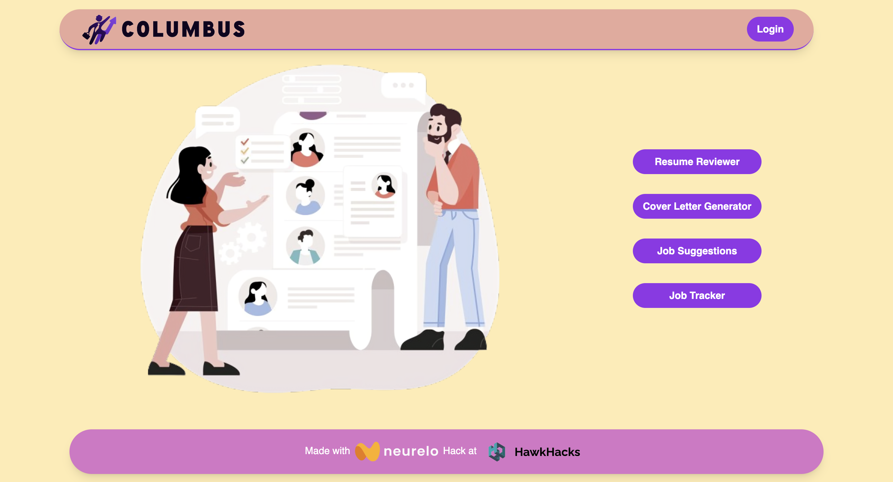

# Columbus

## Project Description

Columbus is an innovative portal designed for job seekers, offering comprehensive services including resume reviews, cover letter generation, personalized job suggestions based on resumes, and a job application tracker. This project will be showcased at the HawkHacks Hackathon 2024 at Wilfrid Laurier University (WLU).

## Team Members

- **Trushit Patel (Wilfrid Laurier University)** - Backend Developer & Team Lead
- **Jainish Patel (McMaster University)** - Frontend Developer & UI/UX Designer
- **Anmol Dhiman (Humber College)** - Backend Developer, Blockchain Specialist & Neurelo Integrator
- **Mohammad Abdul Malik Fazal (Wilfrid Laurier University)** - Backend Developer & Database Manager

## Technologies Used

- **Frontend:** React, Vite, TailwindCSS
- **Backend:** Express.js
- **Blockchain & AI Integration:** Neurelo

## Project Goals

- Provide robust and accurate resume review feedback.
- Generate tailored cover letters efficiently.
- Suggest relevant job opportunities based on user resumes.
- Track job applications in an organized manner.

Columbus aims to streamline the job application process, making it easier and more effective for users to manage their career advancement.

## Images

## Images

